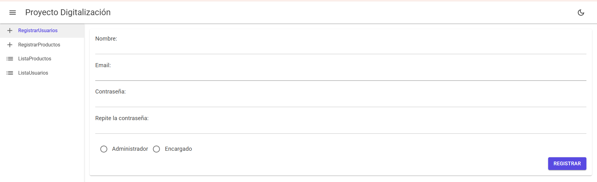

# :hammer_and_wrench: Proyecto Digitalización

Aplicación web desarrollada con MudBlazor y C# por **Raúl Santocildes Garrido**

---
## :scroll: Introducción

Hemos desarrollado una aplicación web para una ferretería, la cuál nos solicitó lo siguiente:
- Un apartado para registrar nuevos empleados/usuarios
- Un apartado para registrar nuevos productos que entran a la ferretería
- Un apartado para listar todos los usuarios que tengamos en nuestra base de datos
- Un apartado para listar todos los productos que tengamos en nuestra base de datos 

Para ello hemos desarollado las siguientes Clases:

|Clases            |Función                                                  |
|------------------|:-------------------------------------------------------:|
|Registro Usuarios |Nos sirve para registrar usuarios  mediane un formulario |
|Registro Productos|Nos sirve para registrar productos mediante un formulario|
|Listar Usuarios   |Nos sirve para listar los usuarios                       |
|Listar Productos  |Nos sirve para listar los productos                      |

---
## :gear: Tecnologías utilizadas
* Entorno de desarrollo: [Visual Studio](https://visualstudio.microsoft.com/es/)
* Lenjuage de programación: [C#](https://dotnet.microsoft.com/es-es/languages/csharp)
* Framework: [MudBlazor](https://mudblazor.com/)
* Base de datos: [Mysql](https://www.mysql.com/) 
